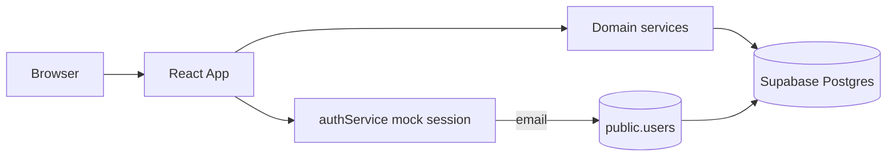
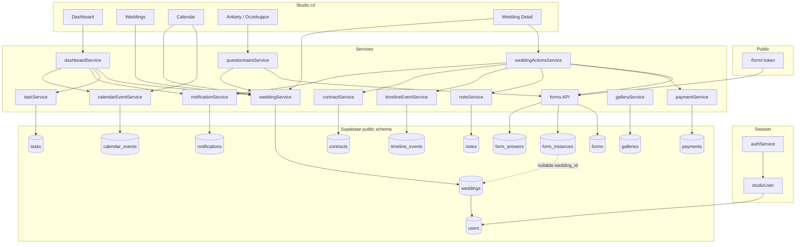
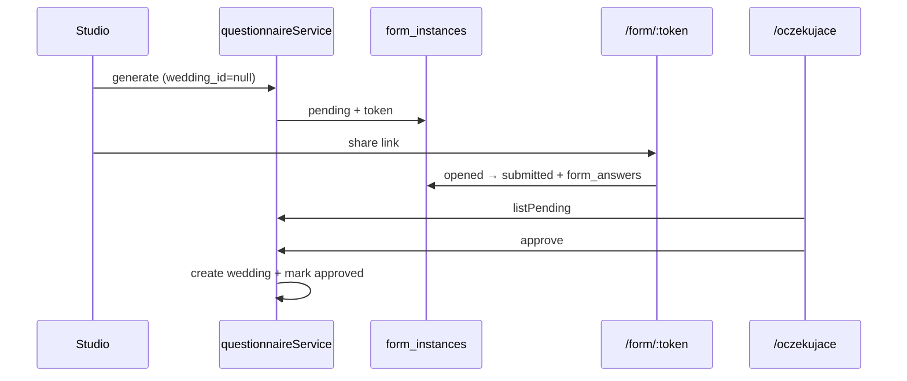

# OurWed — Production Architecture

Wedding photographer CRM. Single-studio product. Supabase is the system of record for domain data. The React app is the studio UI.

Schema source of truth: `supabase/schema.sql`.  
**Schema is frozen** unless an explicit change is requested. Adapt application code to existing tables/columns.

---

## 1. Overall application flow



### Boot sequence

1. `src/main.tsx` mounts React.
2. `src/App.tsx` wraps the tree in:
   - `QueryClientProvider` (TanStack Query)
   - `AuthProvider` (thin adapter over `authService`)
   - `AppRouter` (`src/routes/router.tsx`)
3. Public routes: `/login`, `/form/:token`.
4. All studio routes are behind `ProtectedRoute`.

### Authentication (current)

| Concern | Owner |
| --- | --- |
| Login gate / session | `authService` — mock credentials, memory + `localStorage['ourwed_auth']` |
| Studio profile UUID for writes | `studioUser.resolveStudioUserId()` → `public.users` by email |
| Supabase Auth | **Not** used for CRM login yet |

Mock credentials (temporary):

- Email: `admin@ourwed.pl`
- Password: `test123456`

`AuthProvider` does **not** own a second session copy. It re-renders when `authService` notifies subscribers and always reads `getCurrentUser()` / `isAuthenticated()` from `authService`.

### Studio routes

| Path | Page | Purpose |
| --- | --- | --- |
| `/login` | `LoginPage` | Mock login |
| `/form/:token` | `PublicFormTokenPage` | Public Form Engine intake |
| `/dashboard` | `DashboardPage` | Studio home |
| `/sluby` | `WeddingsPage` | Wedding list |
| `/sluby/nowy` | `NewWeddingPage` | Create wedding |
| `/sluby/:id` | `WeddingDetailPage` | Wedding detail + actions |
| `/kalendarz` | `CalendarPage` | Calendar |
| `/ankiety` | `QuestionnairesPage` | Questionnaire CRM list |
| `/ankiety/:id` | `QuestionnaireDetailPage` | Questionnaire detail |
| `/oczekujace` | `PendingWeddingsPage` | Lead questionnaires awaiting approval |
| `/studio/pakiety` | `PackagesPage` | Studio Catalog — wedding packages CRUD |
| `/studio/uslugi` | `ExtraServicesPage` | Studio Catalog — additional services CRUD |
| `/ustawienia` | `PlaceholderPage` | Settings placeholder |

**Contract reproduction** (official workflow): see [`docs/contract-workflow.md`](./contract-workflow.md).

Layout: each protected page uses `AppLayout` + `Sidebar`.

### Layering

```
UI (pages / features)
  → React Query hooks
    → Domain / action services (src/lib/api/*)
      → Supabase client (src/lib/supabase.ts)
        → Postgres (public.*)
```

Wedding aggregates are assembled in `weddingHydrate.ts` (payments, notes, timeline, contract, gallery, latest contract-form answers).

---

## 2. Dependency diagram



---

## 3. Supabase tables

All tables live in schema `public`. RLS is enabled; temporary `dev_allow_all_*` policies allow full access during early development.

### `users`

Studio photographer profile (one studio today).

| Column | Notes |
| --- | --- |
| `id` | UUID PK |
| `email` | Unique |
| `name` | Display name |
| `avatar_url` | Nullable |
| `created_at` | |

**No `role` column.** Do not select or add `role`.

### `weddings`

Root CRM entity. Almost all wedding-scoped data references this table.

| Notable columns | Notes |
| --- | --- |
| `user_id` | FK → `users` |
| `bride_name`, `groom_name` | |
| `wedding_date`, `ceremony_time`, `venue` | |
| `status` | `active` \| `archived` \| `cancelled` |
| `workflow_stage` | Pipeline stage string (rules live in app code) |
| `package_name`, `contract_value`, `deposit_amount`, `currency` | Commercial scalars |

Workflow stages:

`reservation` → `contract` → `deposit` → `preparation` → `pre_wedding_questionnaire` → `wedding_day` → `post_production` → `completed`

### Child / related tables

| Table | Scope | Purpose |
| --- | --- | --- |
| `contacts` | Wedding | Extra people (planner, parents, …). No dedicated TS service yet. |
| `payments` | Wedding | Deposit / installment / final / other receipts |
| `notes` | Wedding | Studio notes |
| `timeline_events` | Wedding | Audit / history feed |
| `tasks` | Wedding | To-dos with due dates |
| `contracts` | Wedding (1:1) | Contract lifecycle row |
| `calendar_events` | Wedding | Ceremony day, meetings, deliveries |
| `galleries` | Wedding (1:1) | Gallery delivery metadata (`gallery_images` not created yet) |
| `notifications` | **User** | In-app studio notifications (not wedding-scoped) |

### Form Engine tables

| Table | Purpose |
| --- | --- |
| `forms` | Reusable form definitions (`schema` jsonb, `category`, `version`, `is_active`) |
| `form_instances` | Issued tokenized link; **`wedding_id` nullable** for lead questionnaires |
| `form_answers` | One `answer_json` document per submitted instance |

Instance statuses: `pending`, `opened`, `submitted`, `expired`, `revoked`, `approved`, `rejected`, `archived`.

---

## 4. Services

Location: `src/lib/api/`.

| Service | Role |
| --- | --- |
| `authService` | Mock login session (single source of truth for gate) |
| `studioUser` | Resolve `public.users` id/name from session email |
| `weddingService` | CRUD + list weddings; hydrate aggregates |
| `weddingActionsService` | Detail actions (send questionnaire, payment, note, contract) |
| `forms` | Form Engine persistence and public submit |
| `questionnaireService` | CRM Ankiety orchestration over Form Engine |
| `dashboardService` | Dashboard aggregation |
| `calendarEventService` | Calendar rows + wedding-day sync |
| `paymentService` | Payments |
| `noteService` | Notes |
| `timelineEventService` | Timeline |
| `contractService` | Contracts |
| `notificationService` | Notifications |
| `galleryService` | Galleries |
| `taskService` | Tasks |

Supporting mappers/hydrate:

- `src/lib/api/weddings/weddingMappers.ts`
- `src/lib/api/weddings/weddingHydrate.ts`

---

## 5. Form Engine

### Purpose

Reusable, tokenized questionnaires. Definitions live in `forms`; each issued link is a `form_instances` row; submissions are stored as one JSON document in `form_answers`.

### Entry points

| Entry | Path / API |
| --- | --- |
| Public fill | `/form/:token` → `ProductionContractFormPage` |
| CRM generate / list | `/ankiety`, `questionnaireService` |
| Wedding-scoped send | `weddingActionsService.sendQuestionnaire` |
| Persistence | `src/lib/api/forms.ts` |

### Database

- `forms`
- `form_instances` (`wedding_id` optional)
- `form_answers`

### Services / libraries

- `forms` API (`getForm`, `createFormInstance`, `getFormInstanceByToken`, `submitForm`, …)
- `src/lib/forms/formEngine.ts` — validation / field map helpers
- `src/lib/forms/contractQuestionnaireTemplate.ts` — client UI template for contract category (“Dane do umowy”)
- `src/lib/forms/mergeFormAnswersIntoWedding.ts` — merge answers into wedding view model

### Relationships

```
forms 1──N form_instances 1──1 form_answers
form_instances N──0..1 weddings   (null = lead)
```

Form Engine is infrastructure. The CRM Ankiety module is the studio product built on top of it. **Do not change Form Engine behaviour when iterating on CRM UX.**

---

## 6. Wedding lifecycle

### Purpose

Track each wedding from reservation through delivery using `weddings.workflow_stage` plus derived status in application code.

### Entry points

- `/sluby`, `/sluby/nowy`, `/sluby/:id`
- Workflow widgets on Wedding Detail
- Actions that advance stage (e.g. deposit payment)

### Database

- Primary: `weddings.workflow_stage`
- Signals also read from: `payments`, `contracts`, questionnaire flags (hydrated from form answers), `galleries` / deliverables

### Services

- `weddingService` + `weddingHydrate`
- `weddingActionsService`
- `src/lib/workflow/workflowEngine.ts` — `getWorkflowStatus`, `getCurrentStep`, `canAdvanceStage`, recommended actions, stage colours

### Important relationships

Workflow **rules live in TypeScript**, not in Postgres. The DB stores only the current stage string. Hydrated wedding + payments/contract/questionnaire state drives the engine.

---

## 7. Pending questionnaires (leads)

### Purpose

Capture couple data **before** a wedding exists. Submitted lead instances appear in `/oczekujace` for approve → create wedding, or reject.

### Entry points

- Generate: `/ankiety` → Generate modal → `questionnaireService.generate`
- Public: `/form/:token`
- Review: `/oczekujace`, Dashboard `PendingWeddingsCard`
- Detail: `/ankiety/:id`

### Database

- `form_instances` with `wedding_id IS NULL` and `status = 'submitted'`
- `form_answers`
- On approve: new `weddings` row; instance linked and set to `approved`

### Services

- `questionnaireService.listPending`, `approve`, `reject`, `archive`
- `forms.listPendingLeadInstances`, `markFormInstanceApproved`, `rejectFormInstance`
- `weddingService.create` (+ seed contract/calendar/timeline side effects)

### Flow



CRM UI label for contract category: **„Dane do umowy”** (DB category remains `contract`).

---

## 8. Dashboard

### Purpose

Studio home: greeting, next wedding, today’s tasks, notifications, pending lead questionnaires.

### Entry points

- Route: `/dashboard`
- Hook: `useDashboard` → `dashboardService.getDashboardData()`
- Also: `useWeddings`, `useCurrentStudioUser`

### Database (via services)

- `weddings`, `tasks`, `notifications`, `calendar_events`
- Pending card: lead `form_instances` through `questionnaireService.listPending`

### Services

- `dashboardService`
- `weddingService`, `taskService`, `notificationService`, `calendarEventService`
- `questionnaireService` (pending card)

### Relationships

Read-only aggregation. Does not own tables. Display name comes from `studioUser` / `public.users.name` (not a hardcoded demo identity).

---

## 9. Calendar

### Purpose

Month/week views of wedding-linked events (ceremony day, meetings, deliveries).

### Entry points

- Route: `/kalendarz`
- Feature UI: `src/features/calendar/*`
- Sync: `calendarEventService.syncWeddingDayEvents(weddings)`

### Database

- `calendar_events` (`type`: `wedding` \| `meeting` \| `delivery` \| `shoot` \| `other`)

### Services

- `calendarEventService` — `listAll`, `create`, `update`, `delete`, `ensureWeddingDayEvent`, `syncWeddingDayEvents`
- `weddingService.getAll` for couple/stage context
- `workflowEngine` for stage colours in the UI

### Relationships

Every calendar row requires a `wedding_id`. Wedding create seeds a wedding-day event.

---

## 10. Payments

### Purpose

Record money received against a wedding (deposit, installment, final, other).

### Entry points

- Wedding Detail finances + `AddPaymentModal`
- `weddingActionsService.addPayment`

### Database

- `payments` (`type`, `amount`, `payment_date`, `method`, `note`, `wedding_id`)

### Services

- `paymentService.listByWeddingId`, `create`
- `weddingActionsService.addPayment` (also timeline + optional stage advance + notification)

### Relationships

Payments feed finance widgets and deposit-stage advancement in the workflow engine. Actual receipts are rows in `payments`; `weddings.deposit_amount` is the expected amount scalar.

---

## 11. Notes

### Purpose

Internal studio notes on a wedding (optional pin).

### Entry points

- Wedding Detail `NotesSection`, `AddNoteModal`
- `weddingActionsService.addNote`

### Database

- `notes` (`author`, `content`, `pinned`, `wedding_id`)

### Services

- `noteService`
- Author defaults to current studio display name via `getCurrentStudioUser()` when not provided

### Relationships

Note create also appends a `timeline_events` row (`note_added`).

---

## 12. Timeline

### Purpose

Chronological history of meaningful wedding events (system + user actions).

### Entry points

- Wedding Detail `WeddingDetailTimeline`
- Written by actions across the CRM (questionnaire sent, payment, note, contract, approve lead, …)

### Database

- `timeline_events` (`type`, `title`, `description`, `system_generated`, `wedding_id`, optional `created_by` → `users`)

### Services

- `timelineEventService.listByWeddingId`, `create`

### Relationships

Append-only style audit feed for the wedding. Many action services write here after mutating domain state.

---

## 13. Contracts

### Purpose

Track contract document lifecycle per wedding (one row per wedding).

### Entry points

- Wedding Detail / workflow action → `GenerateContractModal`
- `weddingActionsService.generateContract`

### Database

- `contracts` — unique `wedding_id`; status `none` \| `generated` \| `sent` \| `signed`; optional `file_url`, `generated_by`

### Services

- `contractService` — `getByWeddingId`, `create`, `updateStatus`, `attachPdf`
- Seeded when a wedding is created if missing

### Relationships

Workflow engine reads contract status for the contract stage. Contract questionnaire answers (“Dane do umowy”) feed readiness; they live in Form Engine tables, not on `contracts`.

---

## 14. Notifications

### Purpose

In-app alerts for the studio owner (questionnaire sent, deposit received, lead approved, …).

### Entry points

- Dashboard `NotificationsCard`
- Created inside action/questionnaire flows

### Database

- `notifications` — scoped by `user_id` (studio), not `wedding_id`
- Optional polymorphic `entity_type` / `entity_id` / `link`

### Services

- `notificationService.list`, `unread`, `create`, `markRead`
- Always resolves `user_id` via `resolveStudioUserId()`

### Relationships

Studio-scoped inbox. Deep links may point at `/sluby/:id` or related CRM pages.

---

## 15. Galleries

### Purpose

Metadata for delivered client galleries (external provider ready). Image rows are intentionally **not** in the schema yet.

### Entry points

- Hydrated into the `Wedding` view model
- Wedding Detail deliverables UI (`DeliverablesSection`)

### Database

- `galleries` — unique `wedding_id`; `status` (`not_ready` \| `processing` \| `ready` \| `expired`); `gallery_url`, `provider`, `provider_gallery_id`, `expires_at`

### Services

- `galleryService.getByWeddingId`, `listByWeddingIds`, `create`, `update`
- Seeded on wedding create when missing

### Relationships

1:1 with wedding. Workflow/delivery completion can use gallery/deliverable completion signals.

---

## 16. Module summary matrix

| Module | Purpose | Entry points | Tables | Primary services |
| --- | --- | --- | --- | --- |
| Auth / studio user | Gate CRM; resolve profile UUID | `/login`, `ProtectedRoute` | `users` | `authService`, `studioUser` |
| Weddings | Root CRM projects | `/sluby*` | `weddings` (+ children via hydrate) | `weddingService`, `weddingActionsService` |
| Form Engine | Tokenized forms | `/form/:token`, forms API | `forms`, `form_instances`, `form_answers` | `forms` |
| Ankiety CRM | Generate/review/approve questionnaires | `/ankiety*`, `/oczekujace` | Form Engine tables | `questionnaireService` |
| Workflow | Stage pipeline | Wedding Detail | `weddings.workflow_stage` + signals | `workflowEngine` |
| Dashboard | Studio home | `/dashboard` | Multiple (read) | `dashboardService` |
| Calendar | Schedule | `/kalendarz` | `calendar_events` | `calendarEventService` |
| Payments | Money received | Wedding Detail | `payments` | `paymentService` |
| Notes | Internal notes | Wedding Detail | `notes` | `noteService` |
| Timeline | History | Wedding Detail | `timeline_events` | `timelineEventService` |
| Contracts | Contract lifecycle | Wedding Detail | `contracts` | `contractService` |
| Notifications | Studio inbox | Dashboard | `notifications` | `notificationService` |
| Galleries | Delivery metadata | Wedding Detail | `galleries` | `galleryService` |
| Tasks | To-dos | Dashboard / Detail | `tasks` | `taskService` |
| Studio Catalog | Packages, items, extras, prices | `/studio/*` | `packages`, `package_items`, `extra_services`, `wedding_extra_services` | `packageService`, `packageItemService`, `extraServiceService`, `weddingExtraServiceService` |

---

## 17. Studio Catalog (canonical pricing)

Single source of truth for live package/extra pricing. Historical weddings never re-read live catalog prices.

| Concern | Source |
| --- | --- |
| Live packages / items / extras | `packages`, `package_items`, `extra_services` |
| Wedding money (contract, deposit, currency, name) | Snapshot columns on `weddings` |
| Wedding ↔ extras | `wedding_extra_services.price_snapshot` (immutable) |
| Calendar package color | `weddings.accent_color` snapshot |
| Public package select | `packageService.list({ activeOnly: true })` at form render |
| Contract PDF / finances | Wedding snapshots only |

Migration: `supabase/migrations/studio_catalog.sql`.

---

## 18. Architectural constraints

1. **Wedding is the root** of wedding-scoped data. Notifications hang off `users`.
2. **Form Engine is shared** by public intake, CRM Ankiety, and wedding-detail send — keep it stable.
3. **Lead questionnaires** use nullable `form_instances.wedding_id`; approval creates the wedding.
4. **`public.users` has no roles** — single-studio product.
5. **Do not invent schema** (columns/tables/relations) unless explicitly requested; adapt code instead.
6. **Mock auth is temporary** for the gate; domain writes already use `public.users.id`.
7. **Workflow rules are application code**; Postgres stores stage, not the rule engine.
8. **Catalog price changes never rewrite** existing wedding snapshots or `wedding_extra_services.price_snapshot`.

---

## 19. Related docs

- `docs/database.md` — detailed table/column reference
- `supabase/schema.sql` — canonical DDL
- `supabase/migrations/questionnaires_crm.sql` — nullable `wedding_id` + CRM statuses (already merged into schema)
- `supabase/migrations/studio_catalog.sql` — Studio Catalog tables + wedding `package_id` / `accent_color`